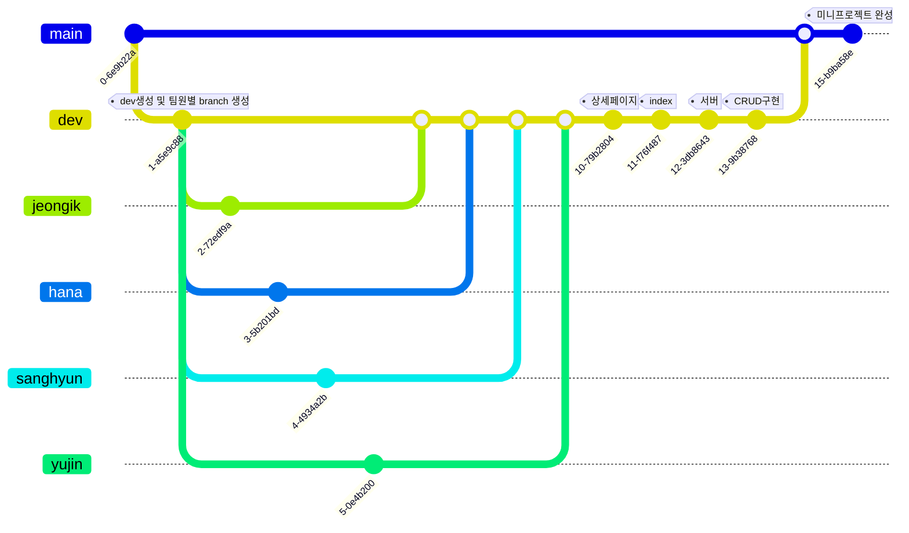

# teamwork01

<h3>version: 1.1</h3>

출신도 코딩경험도 모두 다른 각양각색 9조의 첫 미니 프로젝트!

<div align="center">

<h1>각양각색</h1>
</div>

<div align="center"><h2>Tech Stack</h2></div>
<div align=center>
   
   
   
  
   
  
  
   
  
  
  
</div>

<br>

## 역할

[정하나](https://github.com/Hah-nna)
- 팀장
- DB 구축
- Git & Github Repository 구측
- 홈페이지 이미지 클릭으로 라우팅
- 소개페이지 댓글 `Read`

[박유진](https://github.com/waterfist)
- 새창열기
- 소개페이지 포맷팅

[이정익](https://github.com/Jeremy-Kr)
- DB 통신
- 소개페이지 `merge`
- 소개페이지 `Update` 기능
- `top navigation tabs` 컴포넌트

[김상현](https://github.com/arch-spatula)
- 홈페이지 `main layout`
- 소개페이지 `main layout`
- 소개페이지 `Delete` 기능

<br>

# 프로젝트 소개

팀원을 소개하는 웹 어플리케이션입니다.

<br>

# 협업

## Figma

[각양각색 Figma 링크](https://www.figma.com/file/kzdIWQC81Pz0gS4iyDF3CP/%EA%B0%81%EC%96%91%EA%B0%81%EC%83%89?node-id=0%3A1)

협업을 위해 Figma로 와이어프레임을 만들었습니다. 먼저 동작방식을 중심으로 설계하고 CSS가 적용될 방식을 다음에 설계했습니다.

## Git & GitHub 사용법

의도는 git flow전략으로 협업하려고 했습니다. 

[(알아두면 개발팀장가능) GitFlow vs Trunk-based 협업방식 - 애플코딩](https://www.youtube.com/watch?v=EV3FZ3cWBp8)



의도는 이렇고 실제로는 더 복잡했습니다.

개발 중에는 각자 이름으로 된 브랜치를 만들고 각자 이름으로 된`branch`에 `git push`를 했습니다. 그리고 `dev`에 기능을 `merge`했습니다. 적당한 버전에 `dev`를 `main`에 `merge`했습니다.

## 페어프로그래밍
어느정도 코딩을 경험 해 본 `상현님` 과 `정익님` 이 내비게이터 역할을 하고, `하나님`, `유진님` 이 드라이버역할을 하며 페어 프로그래밍도 경험 해 보았습니다.

# DB


|key|val|
|---|---|
|_id|ObjectId|
|name|작성자 이름|
|text|방명록 본문|


# API 설계
|Method|PATH|기능|
|---|---|---|
|GET|`/:memberName/get`|방명록 불러오기|
|POST|`/:memberName/post`|방명록 생성하기|
|PATCH|`/:memberName/patch`|방명록 수정하기|
|DELETE|`/:memberName/delete`|방명록 삭제하기|

## `PUT Method` 대신 `PATCH Method`를 사용한 이유

- PUT의 경우, DB의 전체를 업데이트 하는 특성이 있습니다.
- 하지만 DB내에서 `ObjectId`의 변경이 불필요한 상황이였기 때문에, `ObjectId`를 유지하고자 `PATCH Method`를 사용하였습니다.

# 팀원들이 뽑은 가장 마음에 드는 코드

`하나`
```js
$(document).ready(() => {
        pageLoading();
      });

      function pageLoading() {
        $('#comment-list').empty();
        $.ajax({
          type: 'GET',
          url: '/hana/get',
          data: {},
          success: function (response) {
            let rows = response.comments;
            rows.forEach(function (val, idx) {
              const { name, text, _id } = val;
              let temp_html = `
              <div class="card mb-3">
                <div class="card-body comments">
                  <div class="comment-header">
                    <h5 class="card-title">${name}</h5>
                    <div class="comment-header-btn">
                      
                      <div onclick="deleteComment('${_id}')"></div>
                    </div>
                  </div>
                  <p class="card-text">${text}</p>
                </div>
              </div>
              `;
              $('#comment-list').append(temp_html);
            });
          },
        });
      }
```

> 첫 번째로는 for문 대신 축약해서 쓸 수 있는 코드를 팀원들에게 배워서 기억에 남는 코드입니다. 또한 코멘트 수정과 삭제 기능을 넣으면서 밑 부분이 좀 더 추가가 되었는데 MongoDB 고유id를 어떻게 가져올지 고민을 많이 했던 코드라 보면서 신기하고 재밌었습니다
> 
> 저도 팀원들처럼 잘 하고 싶은 마음이 솟았던 코드입니다 :>

```js
function 물주먹() {
    window.open('https://github.com/waterfist', '_blank');
}

function 박유진() {
    window.open('https://velog.io/@waterfist', '_blank');
}
```

```html
<a href="" onclick="물주먹()"
    ></a>
<a href="" onclick="박유진()"
    ></a>
```

`유진`
> 92번 줄은 "새로운 창이 열려요."라는 말이다. 깃허브와 벨로그를 누르면 해당 사이트로 이동한다. 현재 창에서 바로 깃허브로 가는 것이 아니다. 새로운 창을 열어 깃허브로 연결해준다. 이 코드가 마음에 드는 이유는 편리성 때문이다. 대원들의 페이지가 궁금한데 다시 돌아가기 눌러서 새로고침이 되는 것보다 창을 닫는 게 빠르기 때문이다. 213번 줄과 연관이 된다. 물주먹, 박유진은 92번의 물주먹, 박유진이다.

`정익`
```js
function editCommentSubmit() {
  let name = $('.modal-name').val();
  let text = $('.modal-text').val();
  let _id = $('.edit-comment-button').attr('id');
  $.ajax({
    type: 'PATCH',
    url: '/jeongik/patch',
    data: { name: name, text: text, _id: _id },
    success: function (response) {
    alert(response['msg']);
    window.location.reload();
    },
  });
}
```
> 이번 프로젝트에서 직접 작성한 로직 중 새로 배운 개념을 가장 많이 쓴 코드!
> 아쉬운 점도 많이 남는 코드라 다음에 리팩토링에 도전에 보려 합니다.
> `let` → `const`로 변경, `name`과 `text` 변수의 유효성 검사 등 추가 해 보고 싶은 로직이 많아요!

`상현`
```js
success: function (response) {
let rows = response.comments;
rows.forEach(function (val, idx) {
    const { name, text, _id } = val;
    let temp_html = `
    <div class="card mb-3">
    <div class="card-body comments">
        <div class="comment-header">
        <h5 class="card-title">${name}</h5>
        <div class="comment-header-btn">
            
            <div onclick="deleteComment('${_id}')"></div>
        </div>
        </div>
        <p class="card-text">${text}</p>
    </div>
    </div>
    `;
    $('#comment-list').append(temp_html);
});
},
```
> 제가 고차함수와 객체 구조분해할당 개념을 알려준 함수입니다. 함수형 프로그래밍처럼 선언형으로 간략해지는 스타일을 좋아합니다. 예습하고 편리하게 사용하는 문법을 알려줄 수 있던 것도 좋았습니다. idx 매개변수가 남아있는 점만 조금 아쉬웠습니다.


# 프로젝트 후 소감

[하나](https://github.com/Hah-nna)

> 얼떨결에 조장이 되었는데 많은 도움이 못 된 거 같아 아쉽습니다. 제가 잘 못 해도 다독여 주신 팀원들 덕분에 끝까지 프로젝트에 참여할 수 있어서 감사한 마음이 큽니다. 또한 같이 협업이 잘 되어서 참여하는 내내 이게 바로 협업 프로젝트구나 하는 생각이 들었습니다.
>
>항상 모르는 거나 자잘한 오류 등등 친절하게 알려주신 정익님과 상현님, 유진님!!
>
>협업의 A to Z를 배울 수 있었습니다 같이 하는 내내 항상 감사했고 나중에 또 봬요 😍  

<br>

[유진](https://github.com/waterfist)
> 저희 조는 협업이 잘 되었습니다. 페어 프로그래밍이라고 개발 방법론 중의 하나로 하나의 개발 가능한 PC에서 두 명의 개발자가 함께 작업하는 것을 말합니다. 내비게이터(navigator)가 전략을 제시하고 드라이버(driver)가 실제 코드를 작성하며, 이 역할을 각자 번갈아 가며 수행합니다. 기본도 못 하는 실력으로 참여하여 번갈아서 하지는 못했지만 내비게이터 대원 덕분에 잘 따라갈 수 있었습니다. 또한 리액션 부자인 팀장님 덕분에 팀 분위기가 한 층 더 밝았습니다. 항상 감사합니다.

<br>

[정익](https://github.com/Jeremy-Kr)
> 첫번째로 적극적인 팀원들을 만나 너무너무 기뻤고, 행복했습니다!
>
> 조금 더 많이 알았다면 하는 아쉬움도 많이 드는 프로젝트였습니다.
>
> 해결하고 싶은 로직들이 많이 남아 있는데 기한 내에 프로젝트 완수를 가장 첫번 째 목표로 두어서 구현 하지 못해 아쉬움이 많이 남는 프로젝트입니다. 다음에 또 발전하고 시간이 남게 되면 새로운 버전으로 업그레이드 해 보고 싶어요!
>
> 또 설계의 중요성을 많이 느낀 프로젝트인 것 같아요! 처음부터 어떻게 프로젝트가 진행될 지 상상하고, 그에 맞는 준비를 잘 하면 조금 더 디테일한 작업이 가능 했을 것 같습니다.

<br>

[상현](https://github.com/arch-spatula)
> git과 github 라는 새로운 기술 스택을 익혔습니다. 엄청나게 어렵고 넘어야하는 산이었습니다. 혼자 개인적으로 쓸 때랑 전혀 달랐습니다. git flow방식으로 협업을 진행했습니다. 실수도 많았지만 꽤 잘 된 것 같았습니다. 협업능력을 엄청 얻어 간 것 같습니다.


# 시연 영상

[](https://www.youtube.com/watch?v=kHl3RhnRMW4)